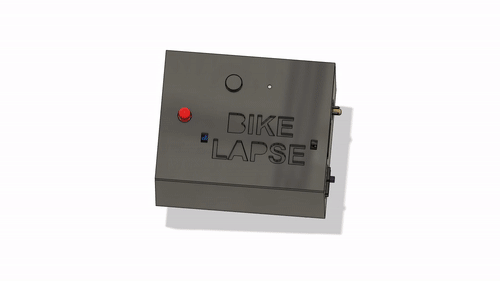

# BikeLapseCameraTrigger Overview

The BikeLapse Camera Trigger is an Arduino based system for using distance (number of wheel rotations on a bike) to trigger a camera shutter release (as opposed to TimeLapse which uses time). It's part of a larger platform called BikeLapse.com that seeks to make it fun and easy to create a virtual catalog of bike rides (or other adventure activities). Plus it's entirely free and open source.

This repository is home to everything you should need to build your own BikeLapse Camera Trigger as seen in the animated GIF above and demo videos below. Once you've made the Camera Trigger hardware, visit the BikeLapse.com GitHub repo to learn how to clone the repo (you'll need to modify a couple things of course) and enable your own BikeLapse style website hosted for free on GitHub pages. (it should take less than an hour to get your own instance up and running thanks to the magic of Github).

# DEMOS
Here's a video showing how the BikeLapse camera trigger works and what it is used for
https://www.youtube.com/watch?v=APi-ftsqltU

Here's a demo of a video that was made by stitching together all of the images captured while using the BikeLapse Camera Trigger
https://www.youtube.com/watch?v=EekVvGeG3ls

To see the virtual bike ride version where the video is geo-synchronized to a map...check out https://bikelapse.com

# PROJECT DESCRIPTION AND BUILD INSTRUCTIONS
Visit http://turnerkirk.com/bikelapse for a thorough description of this project and information on how to make your own.
